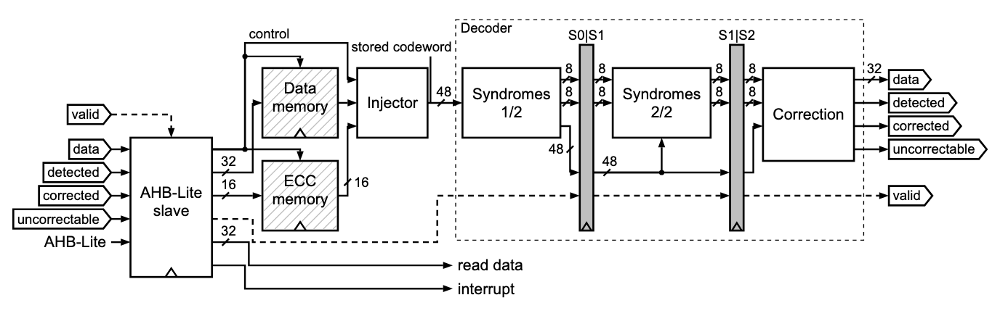
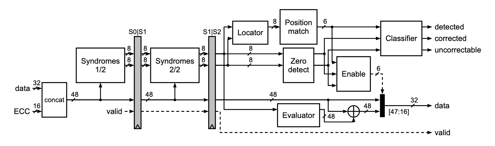
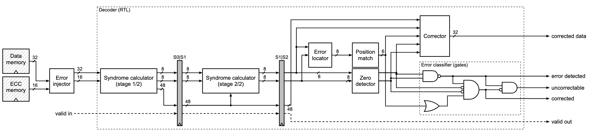
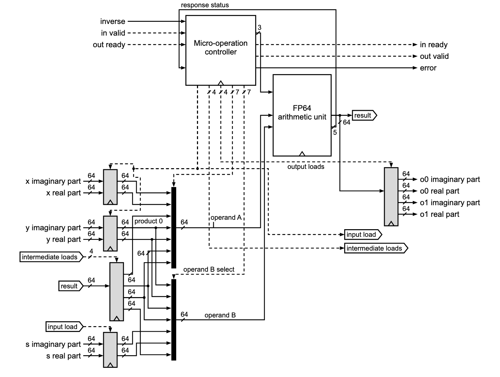
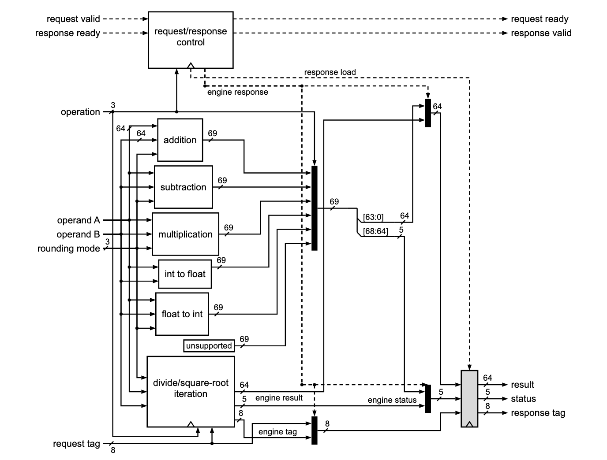
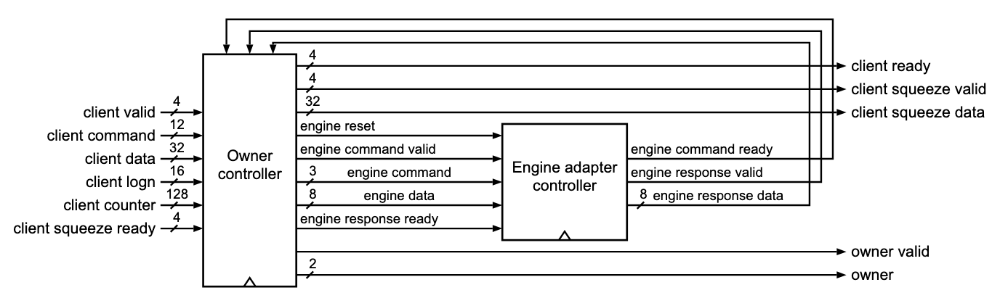

# fig-gen

Claude Code skill for paper-quality hardware figures from typed JSON:
datapath (RTL block/schematic), FSM, timing (waveform) and micro-architecture
diagrams, delivered as editable figma-safe SVG plus outlined-text PDF in both
single- and double-column variants, with RTL cross-checks.

Status: datapath, micro-architecture/SoC, FSM and timing figures are rendered
and delivered (SVG + outlined PDF + receipt) with semantic checks, source-pin
verification, the evidence guard, structural RTL cross-checks (Verilator),
gate-level equivalence for mixed-abstraction regions, FSM extraction and
simulation-grounded waveforms. Drafts can be generated from a netlist
(`fig-gen draft`) and refined by hand. Design and rules: `SPEC.md`,
`references/CONVENTIONS.md`, `SKILL.md`.

## Sample figures

Datapath figures rendered by fig-gen and checked against real RTL
(Verilator netlist, coverage, latency, connectivity). Names only in boxes, uniform strokes, bold
bar muxes, compact registers, slash-N widths, dashed control.

**RS(6,4) ECC accelerator — overview** (whole engine: AHB-Lite slave, memories as
black boxes, injector, pipelined decoder with S0|S1 and S1|S2 bars)



**RS decoder — block view** (syndrome stages, locator, position match, zero
detect, classifier, correction enable, evaluator, ⊕ and correction mux)



**RS decoder — mixed abstraction** (study format: memories as black boxes, RTL
decoder, error classifier drawn as gates and equivalence-checked against the RTL)



**Falcon FFT butterfly — register-transfer view** (input/intermediate/output
register banks, operand A/B selects, shared FP64 arithmetic unit, write-back,
micro-operation controller; handshake signals omitted by declaration)



**Falcon FP64 arithmetic unit — internal view** (calculators, operation select,
divide/square-root iteration engine, response registers, request/response control)



**Falcon SHAKE engine — block view** (owner controller and engine adapter
controller with named request/response nets)



## INSTALL

Requirements: Node.js ≥ 20, Git. Optional: Verilator 5.x (RTL extraction and
simulation).

No browser is needed. PNG previews (`fig-gen preview`, `deliver --preview`)
are rasterised by resvg (`@resvg/resvg-js`, prebuilt for Linux x64/arm64 glibc
and musl, macOS and Windows, installed by `npm ci`) with fig-gen's bundled
fonts, so they work on headless servers and in containers. Headless
Chrome/Chromium is used only if you ask for it (`--rasterizer chrome` or
`FIGGEN_RASTERIZER=chrome`), or as a fallback where resvg has no binary.

Install as a personal skill (all projects):

```bash
git clone https://github.com/nnorr/fig-gen.git ~/.claude/skills/fig-gen
cd ~/.claude/skills/fig-gen
npm ci
node bin/fig-gen.mjs doctor
```

Or as a project skill (checked into / next to one repository):

```bash
git clone https://github.com/nnorr/fig-gen.git .claude/skills/fig-gen
cd .claude/skills/fig-gen && npm ci && node bin/fig-gen.mjs doctor
```

Restart Claude Code afterwards so it picks up `SKILL.md`.

`doctor` reports Node, dependencies, Verilator, resvg (needed for previews)
and Chrome/Chromium (optional). Tool discovery uses `PATH` and well-known
install locations; override with:

| Variable | Meaning |
|---|---|
| `FIGGEN_VERILATOR` | Verilator executable |
| `FIGGEN_RASTERIZER` | preview rasterizer: `resvg` (default) or `chrome` |
| `FIGGEN_CHROME` | Chrome/Chromium executable (only for `chrome` previews) |
| `FIGGEN_ADAPTER` | default RTL adapter id |
| `FIGGEN_ADAPTER_PATH` | path-list of extra adapter modules |

Nothing in this repository refers to a specific machine, user, host, license
server or vendor tool; site-specific tools are plugged in through
`fig-gen.config.json` (see `references/adapters.md`).

## Commands

```bash
# figures without RTL
node bin/fig-gen.mjs validate datapath examples/datapath-pipelined-xor.json --json
node bin/fig-gen.mjs deliver  datapath examples/datapath-pipelined-xor.json out/xor
node bin/fig-gen.mjs deliver  microarch examples/microarch-soc-accelerator.json out/soc

# figures checked against your own RTL
node bin/fig-gen.mjs check-rtl --top my_top --files rtl/*.sv --source-root . --work-dir /tmp/figgen --out netlist.json --summary
node bin/fig-gen.mjs crosscheck datapath my_block.datapath.json --netlist netlist.json
node bin/fig-gen.mjs expand-cone --netlist netlist.json --instance u_core/u_dec --output err_flag --out gates.json
node bin/fig-gen.mjs deliver datapath my_block.datapath.json out/my_block --netlist netlist.json

# utilities
node bin/fig-gen.mjs lint-svg out/xor/datapath-pipelined-xor.2col.svg
node bin/fig-gen.mjs preview  out/xor/datapath-pipelined-xor.2col.svg --scale 2
node scripts/preview.mjs --out preview.png out/xor/*.svg
node bin/fig-gen.mjs doctor
npm test
```

`deliver` writes `<name>.2col.svg/.pdf` (required), `<name>.1col.svg/.pdf`
(best effort; skipped with an info diagnostic if one column cannot be made
legible), address-map tables for SoC figures, and `<name>.receipt.json` with
per-region verification, evidence origins and per-variant route metrics
(straight data nets, redundant jogs, crossings per class).

`--quality paper` (validate/render/deliver) turns readability warnings such as
`label/unreadable` (mnemonics or RTL names printed as block names) into errors.
Blocks are named by `function` from `schemas/function-vocabulary.json`; see
`references/CONVENTIONS.md` §4.3.

## License

MIT. Dependencies and their licenses: `THIRD_PARTY_NOTICES.md`.
